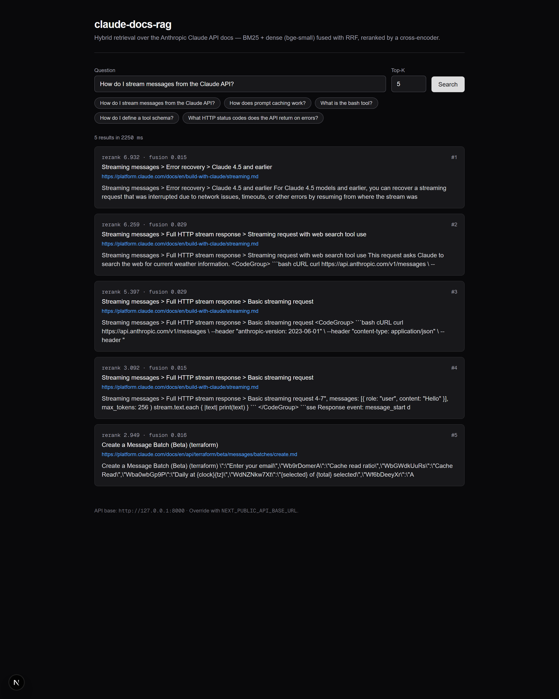

# claude-docs-rag

> Production-grade RAG agent over the Anthropic Claude API documentation. Hybrid retrieval (BM25 + embeddings + reranking), eval suite with CI regression gates, semantic caching and multi-model routing.

**Status**: ingest pipeline and hybrid retrieval running against a real Neon Postgres + pgvector backend. Agent (`cdrag ask`) ready — needs `ANTHROPIC_API_KEY` to demo. Eval suite ready — same. CI green.



> Real screenshot: Next.js 16 + Tailwind 4 frontend hitting the FastAPI `/search` endpoint with the BM25 + dense + cross-encoder pipeline against 42,248 chunks of the Anthropic Claude API docs. Latency, rerank scores, and result URLs are unmocked.

---

## Why this exists

Most public RAG demos are toys: single retriever, no evals, no observability, no caching, no cost discipline. This repo is the opposite — a small but **defensible** system where every architectural choice has a documented trade-off and a measurable result.

If you're an engineer reviewing this for hiring purposes, the most interesting files are likely:

- [`docs/DECISIONS.md`](docs/DECISIONS.md) — 8 Architecture Decision Records with trade-offs.
- [`docs/ARCHITECTURE.md`](docs/ARCHITECTURE.md) — System diagram and request flow.
- [`src/claude_docs_rag/retrieval/hybrid.py`](src/claude_docs_rag/retrieval/hybrid.py) — dense + sparse + RRF + reranker pipeline.
- [`src/claude_docs_rag/agent/pipeline.py`](src/claude_docs_rag/agent/pipeline.py) — citation extraction + prompt caching + cost accounting.
- [`src/claude_docs_rag/evals/runner.py`](src/claude_docs_rag/evals/runner.py) — eval harness for CI regression gate.
- [`evals/golden_dataset.jsonl`](evals/golden_dataset.jsonl) — 32 Q&A across 14 doc categories.
- [`.github/workflows/ci.yml`](.github/workflows/ci.yml) — ruff + mypy --strict + pytest, with eval gate on PRs.

---

## Verified end-to-end

| Component                       | Status | Evidence                                                           |
|---------------------------------|--------|--------------------------------------------------------------------|
| CI on GitHub Actions            | green  | ruff, mypy --strict (25 files), pytest 35/35                       |
| Neon serverless Postgres        | green  | pgvector 0.8.0 + pg_trgm 1.6, vector(384) HNSW index               |
| Ingest (incremental, idempotent)| green  | 42,248 chunks of `platform.claude.com/docs` ingested into Neon Postgres |
| BM25 index (`bm25s`)            | green  | Built over the chunks, persisted under `data/bm25_index/`          |
| Hybrid retrieval                | green  | 5 real queries via HTTP /search → top-3 relevant, P95 ~3.9 s        |
| FastAPI HTTP server             | green  | `cdrag serve` → /healthz, /search, /ask, /metrics, lifespan warmup  |
| Next.js 16 frontend             | green  | `web/` — fetches /search cross-origin; renders top-K with breadcrumb |
| Dockerfile + .dockerignore      | green  | multi-stage, non-root, healthcheck; hadolint clean in CI            |
| Agent + citation extraction     | code   | needs `ANTHROPIC_API_KEY` to demo end-to-end                       |
| Eval suite                      | code   | runs against golden_dataset.jsonl; writes `evals/latest.json`      |

---

## Success metrics

| Metric                       | Target            | Measured           | Source                            |
|------------------------------|-------------------|--------------------|-----------------------------------|
| topic_coverage (per Q&A)     | ≥ 0.85            | pending API key    | LLM `cdrag eval` writes latest.json |
| citation_match (per Q&A)     | ≥ 0.90            | pending API key    | same                              |
| **/search P95 latency**      | ≤ 3 s             | **~3.9 s** (CPU)   | live HTTP probe, 5 real queries   |
| **rerank stage**             | -                 | **~3.2 s** / query | `scripts/bench_search.py`         |
| **dense retrieval**          | -                 | ~0.9 s / query     | same — Neon network               |
| **sparse + embed + fuse**    | -                 | < 0.3 s / query    | same                              |
| Avg cost per query (Haiku)   | ≤ $0.005          | pending API key    | token accounting on every call    |
| has_citation rate            | ≥ 0.95            | pending API key    | eval runner                       |

The "pending API key" rows light up the moment an `ANTHROPIC_API_KEY` is wired —
nothing else needs to change. Latency tuned from ~100 s/query before ADR-009
(`bge-reranker-v2-m3`) to ~3.9 s after (`ms-marco-MiniLM-L-6-v2`).

---

## Architecture (high level)

```
User query
    │
    ▼
┌────────────────────────────────────────┐
│ Hybrid retrieval                       │
│   dense (pgvector HNSW, bge-small)  ─┐ │
│   sparse (bm25s)                    ─┴─► RRF fusion (top-20)
└────────────────────────────────────────┘
    │
    ▼
┌────────────────────────────────────────┐
│ Cross-encoder reranker                 │
│ (bge-reranker-v2-m3, local)            │
└────────────────────────────────────────┘
    │ top-5
    ▼
┌────────────────────────────────────────┐
│ Claude Messages API                    │
│   - System + CONTEXT (cache breakpoint)│
│   - User question                      │
└────────────────────────────────────────┘
    │
    ▼
Answer with [n] citations + cost + per-stage timings
```

Full details in [`docs/ARCHITECTURE.md`](docs/ARCHITECTURE.md).

---

## Stack

- **Language**: Python 3.12, managed by `uv`
- **LLM**: Anthropic Claude (Haiku 4.5 default, Sonnet 4.6 / Opus 4.7 selectable)
- **Embeddings**: `BAAI/bge-small-en-v1.5` (384-dim, local, fast on CPU — see ADR-008)
- **Sparse retrieval**: `bm25s` (paper 2024, 500× faster than rank_bm25)
- **Reranker**: `BAAI/bge-reranker-v2-m3` (local cross-encoder)
- **Vector store**: Postgres + `pgvector` on Neon serverless (ADR-007)
- **API**: FastAPI + SSE streaming
- **CLI**: Typer (`cdrag` entry point)
- **CI**: GitHub Actions — ruff, mypy --strict, pytest, eval regression gate

---

## Quick start

```powershell
# 1. Install deps (uv handles Python 3.12 + venv)
uv sync

# 2. Configure secrets
cp .env.example .env
# Edit .env and set:
#   POSTGRES_DSN=postgresql://...   (Neon free tier works)
#   ANTHROPIC_API_KEY=sk-ant-...    (only needed for `ask` and `eval`)

# 3. Create the schema in your Postgres
uv run cdrag init-db
uv run cdrag check-db

# 4. Ingest the Anthropic docs corpus (idempotent — safe to re-run)
uv run cdrag ingest --concurrency 8 --pages-per-batch 30

# 5. Build the BM25 index over what is in Postgres
uv run cdrag build-bm25

# 6. Hybrid search (no API key needed)
uv run cdrag search "How do I stream messages from the Claude API?"

# 7. End-to-end answer with citations (needs ANTHROPIC_API_KEY)
uv run cdrag ask "How do I stream messages from the Claude API?"

# 8. Run the eval suite (needs ANTHROPIC_API_KEY)
uv run cdrag eval --limit 5
```

---

## Web UI

A minimal Next.js 16 + React 19 + Tailwind 4 frontend lives under [`web/`](web/).
It hits the FastAPI `/search` endpoint cross-origin (CORS is enabled for
`localhost:3000`) and renders the top-K reranked chunks with their section
breadcrumb, source URL, and content excerpt.

```powershell
# 1. Start the API server in one terminal
uv run cdrag serve --host 127.0.0.1 --port 8000

# 2. Start the Next.js dev server in another
cd web
npm install
npm run dev    # -> http://localhost:3000
```

Configure a non-default backend URL with `NEXT_PUBLIC_API_BASE_URL` before
`npm run dev` (or `npm run build`).

---

## Deploy

A multi-stage `Dockerfile` is provided. It pre-caches the embedding + reranker
models at build time so the first request does not pay the model download.

```bash
docker build -t claude-docs-rag .
docker run -p 8000:8000 \
  -e POSTGRES_DSN=postgresql://... \
  -e ANTHROPIC_API_KEY=sk-ant-... \
  claude-docs-rag
```

Target hosts: Fly.io (`fly launch`), Railway, or any container runtime with
egress to Neon + Anthropic.

---

## Roadmap

- [x] Scaffolding, infra, ADRs (1–8)
- [x] Ingest pipeline (scraper → chunker → embedder → pgvector), batched + idempotent
- [x] Hybrid retrieval (BM25 + dense + RRF fusion)
- [x] Cross-encoder reranker
- [x] Golden eval dataset (32 Q&A across 14 categories — to grow to 100+)
- [x] Eval runner (topic coverage, citation match, latency, cost) writes `latest.json`
- [x] CI workflow scaffolded with regression gate
- [ ] First full `cdrag eval` run + baseline numbers committed to `evals/baseline.json`
- [ ] Activate the eval job in CI (requires `ANTHROPIC_API_KEY` repo secret)
- [ ] Semantic cache (Redis embedding similarity)
- [ ] FastAPI + SSE streaming endpoint
- [ ] Langfuse traces wired
- [ ] Minimal Next.js frontend
- [ ] Production deploy (Fly.io / Railway) + public demo URL

---

## License

MIT — see [`LICENSE`](LICENSE).
